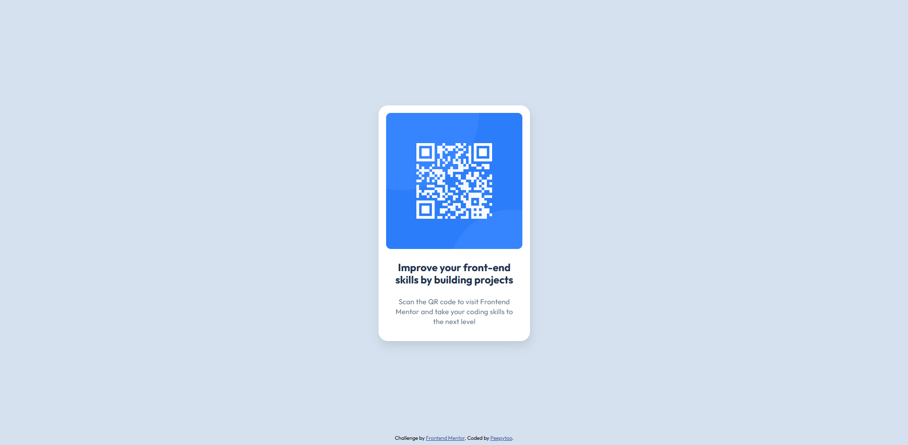

# Frontend Mentor - QR code component solution

This is a solution to the [QR code component challenge on Frontend Mentor](https://www.frontendmentor.io/challenges/qr-code-component-iux_sIO_H). Frontend Mentor challenges help you improve your coding skills by building realistic projects. 

## Table of contents

- [Overview](#overview)
  - [Screenshot](#screenshot)
  - [Links](#links)
- [My process](#my-process)
  - [Built with](#built-with)
  - [What I learned](#what-i-learned)
  - [Continued development](#continued-development)
  - [Useful resources](#useful-resources)
- [Author](#author)
- [Acknowledgments](#acknowledgments)

## Overview

### Screenshot

### Links

- Solution URL: [Add solution URL here](https://github.com/Peepytoo/QR-code-project?tab=readme-ov-file)
- Live Site URL: [Add live site URL here](https://qr-code-project-kappa.vercel.app/)

## My process

### Built with

- HTML5 markup
- CSS
- Flexbox
- Figma application
- Vercel live server host (https://vercel.com/home)

**Note: These are just examples. Delete this note and replace the list above with your own choices**

### What I learned

Just some basic flexbox stuff but it's my first time using it.

body{
    background-color: #D5E1Ef;
    font-family: outfit;
    margin: 0px;
    display: flex;
    justify-content: center;
    align-items: center;
    height: 100vh;
    flex-direction: column;
}

### Continued development

I definitely want to continue working on my flex box skills and also learning more CSS and HTML functions.

### Useful resources

- [Brocode CSS guide](https://www.youtube.com/watch?v=wRNinF7YQqQ&t=2s) - Really simple and straightforward tutorial that helped me with all the basic CSS tools.
- [w3 schools for flexbox](https://www.w3schools.com/css/css3_flexbox_container.asp) - This helped me to quickly learn flexboxes and how to use them as a centering tool.

## Author

- Website - [Peepytoo]
- Frontend Mentor - [@Peepytoo](https://www.frontendmentor.io/profile/Peepytoo)

